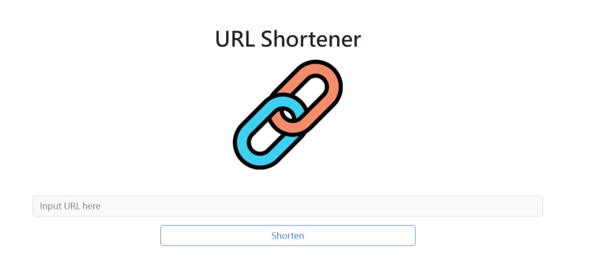
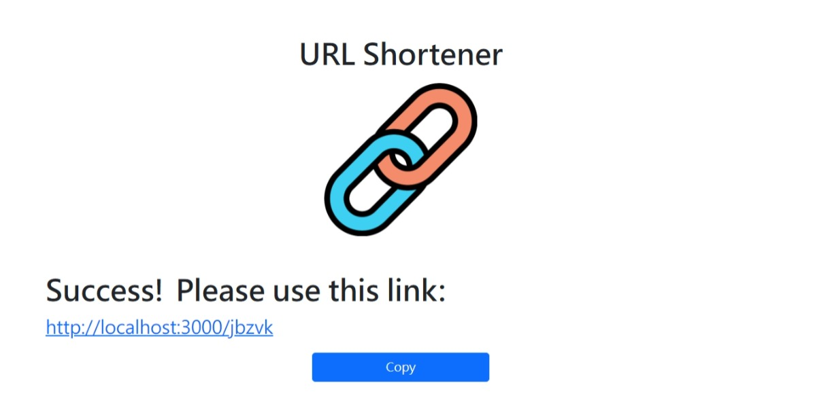

# url-shortener


## 環境建置與需求 (prerequisites)
* Node.js
* MongoDB
## 安裝與執行步驟 (Installation and Execution)
1. Clone the repository
```
git clone https://github.com/homtele/url-shortener.git
```
2. Install dependencies
```
cd url-shortener
npm install
```
3. Run the project
```
npm start
```
Navigate to http://localhost:3000
## 功能描述 (Features)
* 送出表單之後，畫面會回傳格式化後的短網址
* 輸入提供的短網址，瀏覽器會導向原本的網站
* 輸入相同網址時，產生一樣的縮址
* 若沒有輸入內容，表單不會送出並會產生提示
* 按 Copy 可以複製縮短後的網址
* 點擊圖片會回到首頁
